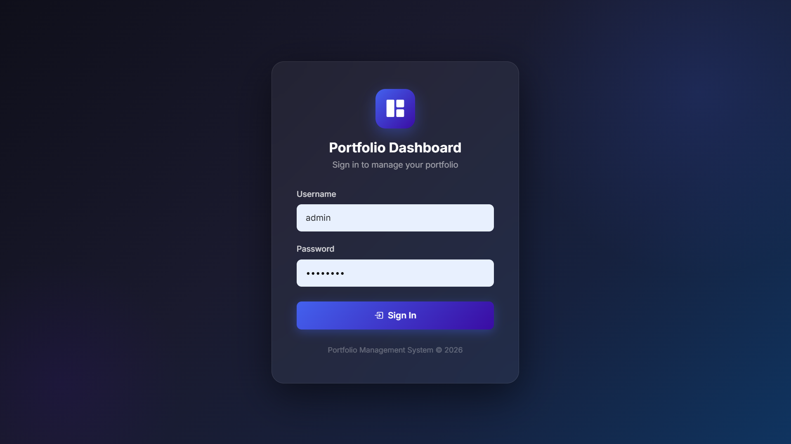
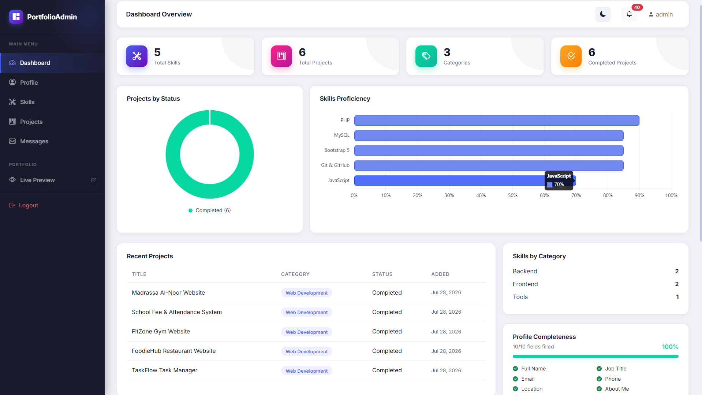
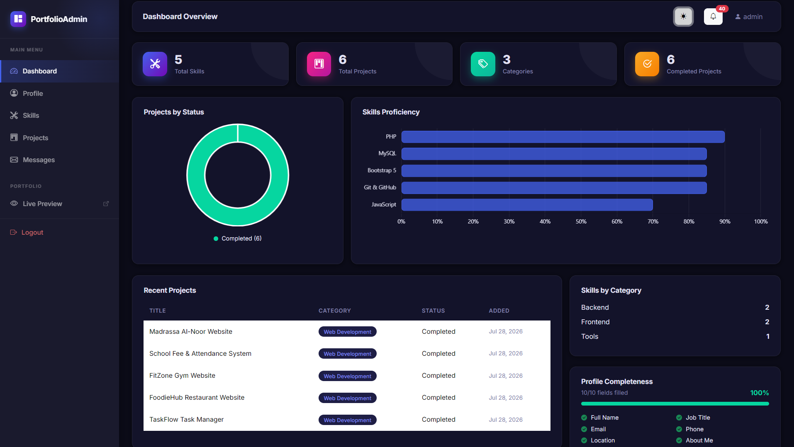
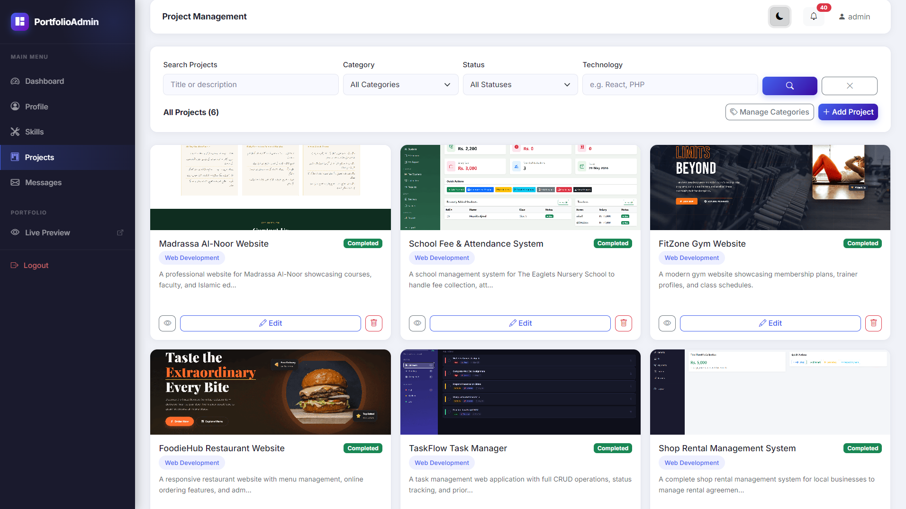
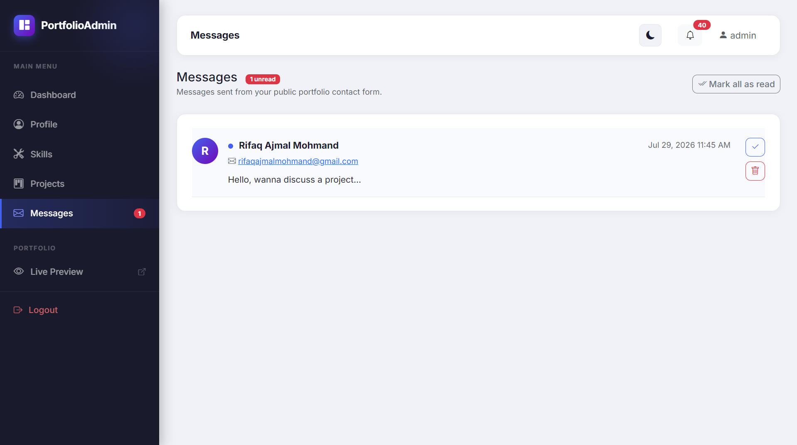
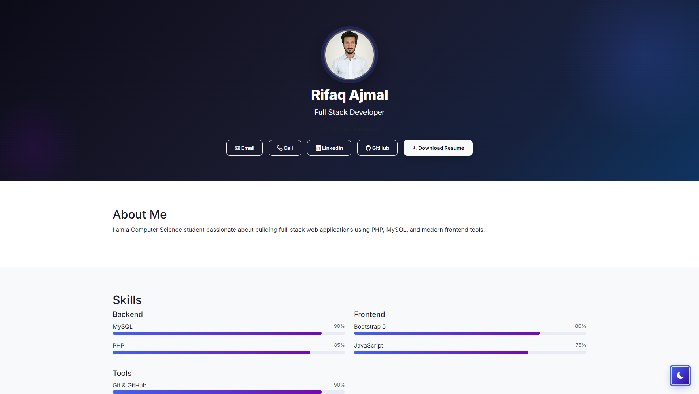
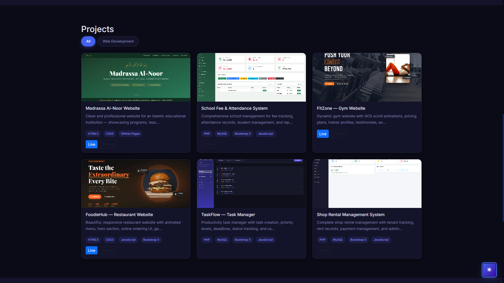

# 🚀 Codiora Full Stack Internship — 2 Months

**Intern:** Rifaq Ajmal | BS Computer Science, UET Mardan, Pakistan  
**Company:** Codiora | **Duration:** 2 Months (8 Weeks) | **Role:** Full Stack Developer Intern

---

## 🌐 Live Demo

| | |
|---|---|
| 🖥️ **Admin Dashboard** | http://rifaqportfolio.gamer.free/login.php |
| 🌍 **Public Portfolio** | http://rifaqportfolio.gamer.free/preview.php |

> **Login:** admin / admin123

---

## 📁 Project — Portfolio Management System

A full-stack portfolio management system built with **PHP 8.3, MySQL, Bootstrap 5 & JavaScript** — no frameworks, built from scratch over 8 weeks.

### ✅ Features
- 🔐 Secure Login & Session Management
- 👤 Profile Management (photo, resume, social links)
- 🛠️ Skills CRUD with proficiency bars
- 📁 Projects CRUD with images, search & filters
- 📊 Chart.js Analytics Dashboard
- 🌙 Dark / Light Mode
- 📩 Messages Inbox (real contact form)
- 📈 Profile Completeness Tracker
- 🌍 Public Portfolio Page
- ♿ Full Accessibility (ARIA, labels, semantic HTML)

---

## 📅 8-Week Journey

| Week | What I Built |
|------|-------------|
| 1 | Environment setup — XAMPP, VS Code, Git |
| 2 | Admin dashboard, login, skills & projects CRUD |
| 3 | Activity log, public portfolio page, categories, pagination |
| 4 | Notifications system, change password, auth hardening |
| 5 | Live deployment to InfinityFree, environment config |
| 6 | Social links, resume upload, animations, DB indexes |
| 7 | Full accessibility audit, security cleanup, documentation |
| 8 | Dark mode, Chart.js charts, messages inbox, visual redesign |

---

## 🛠️ Tech Stack

`PHP 8.3` `MySQL` `Bootstrap 5` `JavaScript` `Chart.js` `InfinityFree`

---

## 📸 Screenshots

### Login Page

### Dashboard — Light Mode

### Dashboard — Dark Mode

### Projects Management

### Messages Inbox

### Public Portfolio

### Public Portfolio — Dark Mode

---

📄 **Full documentation:** [portfolio_dashboard/README.md](portfolio_dashboard/README.md)  
🔗 **LinkedIn:** https://linkedin.com/in/rifaqajmal  
🐙 **GitHub:** https://github.com/Rifaqajmal
